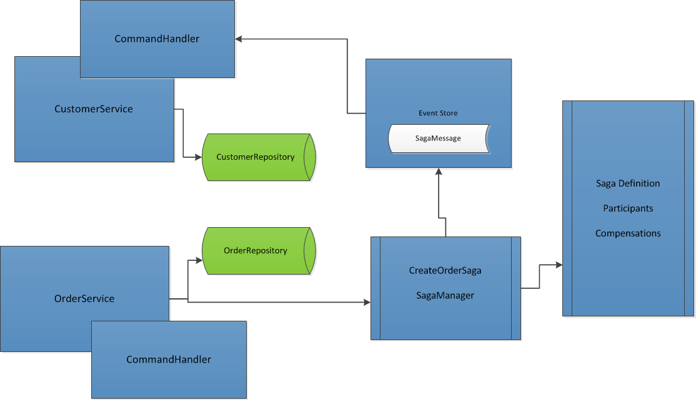

# light-saga-4j end-to-end integration test

A saga implementation to manage distributed transaction across multiple microservices


The order service module use in memory data repository and message publish/subscribe to implement end-to-end test for saga process based light-saga framework.

A saga consists of a series of steps.
Each step consists of either transaction, a compensating transaction or both.
Each transaction is the invocation of a saga participant using a command message.
A saga executes the forward transactions sequentially.
If one of them fails then the saga executes the compensating transactions in reverse order to rollback the saga.

==workflow diagram

 


== Writing an orchestrator

In the order creation example, the `CreateOrderSaga` consists of the following three steps:

1. The `CreateOrderSaga` is instantiated after the `Order` is created.
Consequently, the first step is simply a compensating transaction, which is executed in the credit cannot be reserved to reject the order.
2. Requests the `CustomerService` to reserve credit for the order.
If the reservation is success, the next step is executed.
Otherwise, the compensating transactions are executed to roll back the saga.
3. Approves the order, if the credit is reserved.

Here is part of the definition of `CreateOrderSaga`.

```java
public class CreateOrderSaga implements SimpleSaga<CreateOrderSagaData> {

  private SagaDefinition<CreateOrderSagaData> sagaDefinition =
          step()
            .withCompensation(this::reject)
          .step()
            .invokeParticipant(this::reserveCredit)
          .step()
            .invokeParticipant(this::approve)
          .build();


  @Override
  public SagaDefinition<CreateOrderSagaData> getSagaDefinition() {
    return this.sagaDefinition;
  }


  private CommandWithDestination reserveCredit(CreateOrderSagaData data) {
    long orderId = data.getOrderId();
    Long customerId = data.getOrderDetails().getCustomerId();
    Money orderTotal = data.getOrderDetails().getOrderTotal();
    return send(new ReserveCreditCommand(customerId, orderId, orderTotal))
            .to("customerService")
            .build();

...
```

The `reserveCredit()` creates a message to send to the `Customer Service` to reserve credit.

== Creating an saga orchestrator

The `OrderService` creates the saga:

```java
public class OrderService {


  private SagaManager<CreateOrderSagaData> createOrderSagaManager;


  private OrderRepository orderRepository;

  public OrderService(OrderRepository orderRepository, SagaManager<CreateOrderSagaData> createOrderSagaManager) {
    this.orderRepository = orderRepository;
    this.createOrderSagaManager = createOrderSagaManager;
  }

  public Order createOrder(OrderDetails orderDetails) {
    ResultWithEvents<Order> oe = Order.createOrder(orderDetails);
    Order order = oe.result;
    orderRepository.save(order);
    CreateOrderSagaData data = new CreateOrderSagaData(order.getId(), orderDetails);
    createOrderSagaManager.create(data, Order.class, order.getId());
    return order;
  }

}
```

== Writing a saga participant

Here is the  `CustomerCommandHandler`, which handles the command to reserve credit:

```java
public class CustomerCommandHandler {

  private CustomerRepository customerRepository;

  public CustomerCommandHandler(CustomerRepository customerRepository) {
    this.customerRepository = customerRepository;
  }

  public CommandHandlers commandHandlerDefinitions() {
    return SagaCommandHandlersBuilder
            .fromChannel("customerService")
            .onMessage(ReserveCreditCommand.class, this::reserveCredit)
            .build();
  }

  public Message reserveCredit(CommandMessage<ReserveCreditCommand> cm) {
    ReserveCreditCommand cmd = cm.getCommand();
    long customerId = cmd.getCustomerId();
    Customer customer = (Customer)customerRepository.findOne(customerId);
    try {
      customer.reserveCredit(cmd.getOrderId(), cmd.getOrderTotal());
      return CommandHandlerReplyBuilder.withSuccess(new CustomerCreditReserved());
    } catch (CustomerCreditLimitExceededException e) {
      return CommandHandlerReplyBuilder.withFailure(new CustomerCreditReservationFailed());
    }
  }

  // withLock(Customer.class, customerId).


}

```
